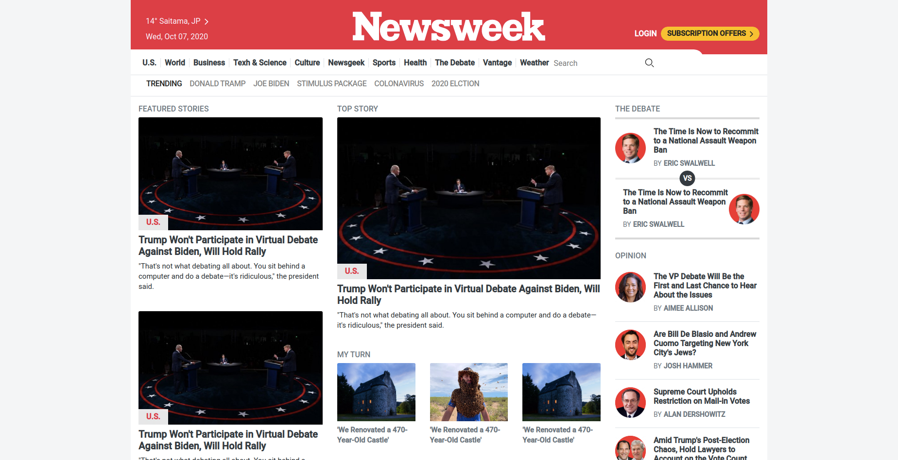

# News week homepage clone.

## Definition

We have used bootstrap 4 while building this website to make responsive and used some of custom styling per our need.

## About the Project

This project is about building a [news week](https://www.newsweek.com/) homepage using bootstrap 4
and making it responsive on every devices.

The features of this project are listed as below:
1. The website is completely responsive with different brekpoint provided by bootstrap:
    - Below 575px for mobile screen
    - In between 575px and 768px larger mobile screen.
    - In between 768px and 992px for medium screen (tablet).
    - In between 992px and 1200px for laptop and desktop.
    - Above 1200px for large screen.

2. The site contains information:
    - Header with site navigation links.
    - Top Stroy
    - Featured stories.
    - The debate.
    - Opinions.
    - More stories.
    - Different articles.
    - In the magazine.
    - Editor's Pick
    - Subscribe and newsletter.
    - Footer with other useful links.

## Built With

- HTML5
- CSS3
- Bootstrap 4
- Javascript

## Live Demo

[Live Demo Link](https://yocosaka.github.io/newsweek-clone/)

## Getting Started

**Just clone this repo and open index.html file in your browser then you are good to go.**

**To get a local copy up and running follow these simple example steps.**

**clone the repo.**

## Authors

👤 **Yoko Saka / Vicky**

- GitHub: [@yocosaka](https://github.com/yocosaka)
- Twitter: [@yocosaka](https://twitter.com/yocosaka)
- LinkedIn: [Yoko Saka](https://www.linkedin.com/in/yokosaka)

👤 **Dipesh Bajgain**

- GitHub: [@dipbazz](https://github.com/dipbazz)
- Twitter: [@dipbazz](https://twitter.com/dipbazz)
- LinkedIn: [Dipesh Bajgain](https://www.linkedin.com/in/dipbazz/)

## 🤝 Contributing

Contributions, issues, and feature requests are welcome!

## Show your support

Give a ⭐️ if you like this project!

## Acknowledgments

- icons used from [iconify](https://iconify.design/)
- The news week footer logo from [worldvectorlogo](https://worldvectorlogo.com/ja/logo/newsweek)
- Other images and logo have been download from the [newsweek](https://www.newsweek.com/).

## 📝 License

This project is [MIT](./LICENSE) licensed.
